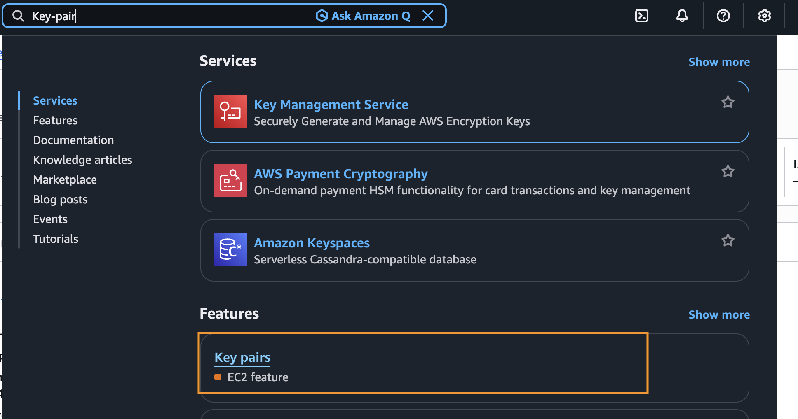
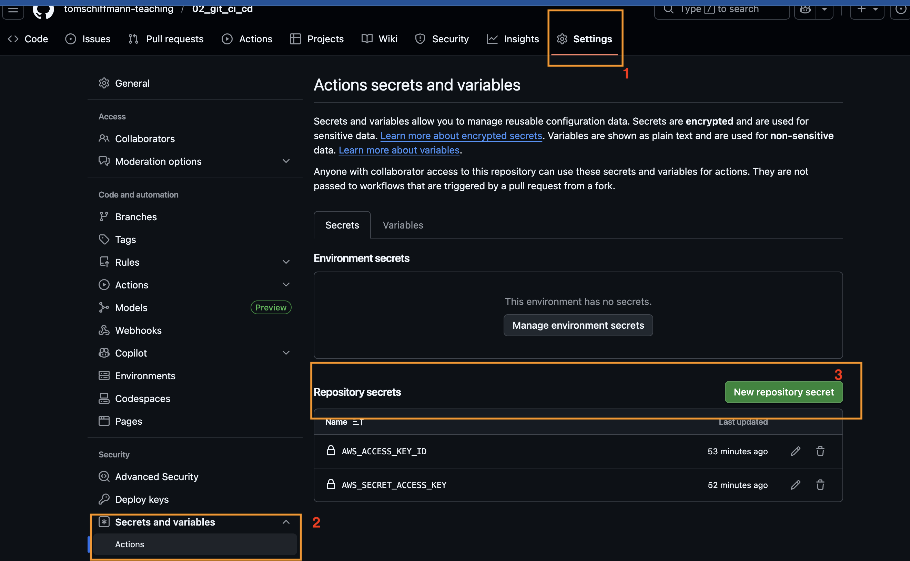

# Terraform CI/CD

1. AWS Sandbox erstellen
2. Über AWS Console (Incognito)
3. S3-Bucket erstellen für den Terraform state
4. Key-Pair erstellen (ssh-key-pair) --> Privater Schlüssel landet in downloads
   
5. Neues Repository anlegen (mit Readme.md auf main)
6. `git checkout main`
7. `git checkout -b feature/deployment-ci-cd`
8. [main.tf](main.tf) kopieren und in euer neues repository einfügen
9. S3-Bucket key für Tfstate austauschen

```bash
  backend "s3" {
    bucket = "<bucket-name>" # <-- Bucket Name
    key    = "app/terraform.tfstate"
    region = "us-east-1"
  }
```

10. Key-Pair Name austauschen

```bash
resource "aws_instance" "demo" {
  ami                    = "ami-0b6c6ebed2801a5cb" # ubuntu
  instance_type          = "t2.micro"
  key_name               = "euer-key-pair-name" # <-- HIER
  vpc_security_group_ids = [aws_security_group.ssh.id]
  tags = {
    Name = "test-server-iac"
  }
}
```

11. [.github](.github) Verzeichnis kopieren und bei euch ins repo einfügen
12. [.gitignore](.gitignore) kopieren und in euer repo einfügen
13. Auf euer github.com reposiotry (das neue) und secrets hinterelgen

- `AWS_ACCESS_KEY_ID`
- `AWS_SECRET_ACCESS_KEY`
  

14. `Commit` mit message
15. Branch veröffentlichen
16. Pull Request (PR) erstellen
17. Über Actions die Pipelines verfolgen
18. Mergen des PRs
19. Wieder Actions beobachten
20. In der AWS Console überprüfen, ob die EC2 Instanz erstellt wurde
21. Probieren, ob ihr euch auf die EC2 Instanz verbinden könnt (via Instance Connect)
22. Optional: Probiert, ob ihr euch mit dem privatem Schlüssel von eurem Computer aus auf die EC2 Instanz verbinden könnt
23. Optional: Versucht das destroy script nun von eurem Laptop aus zu starten
