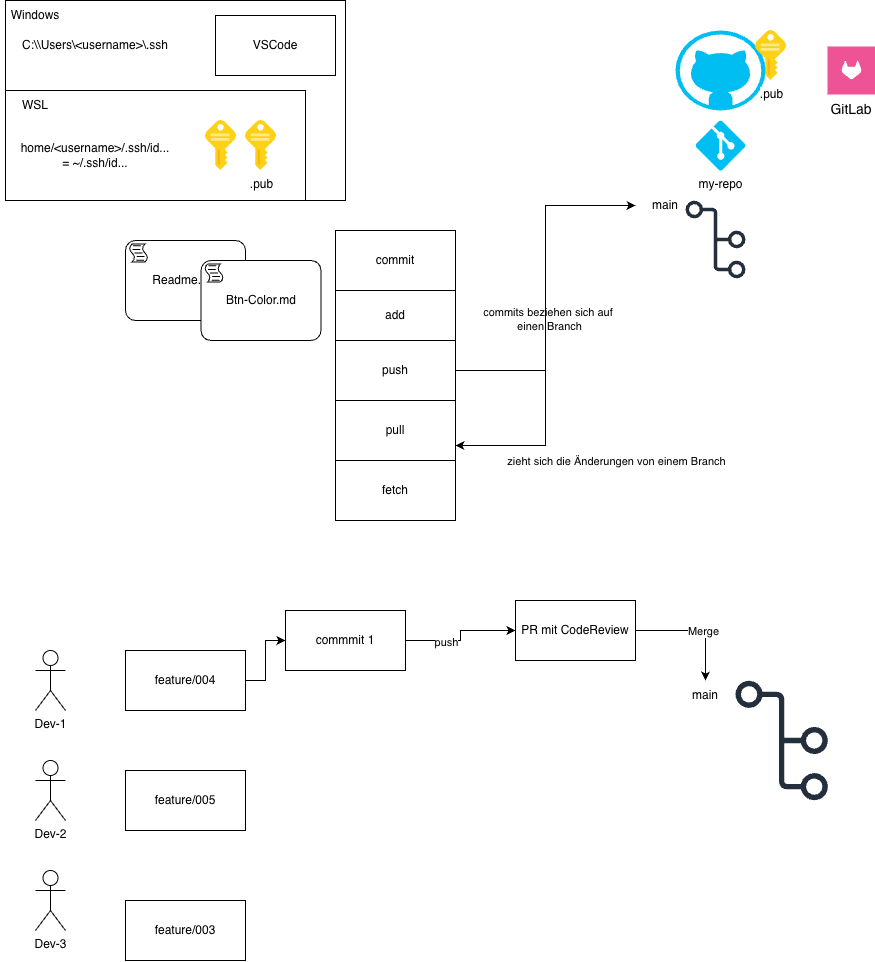
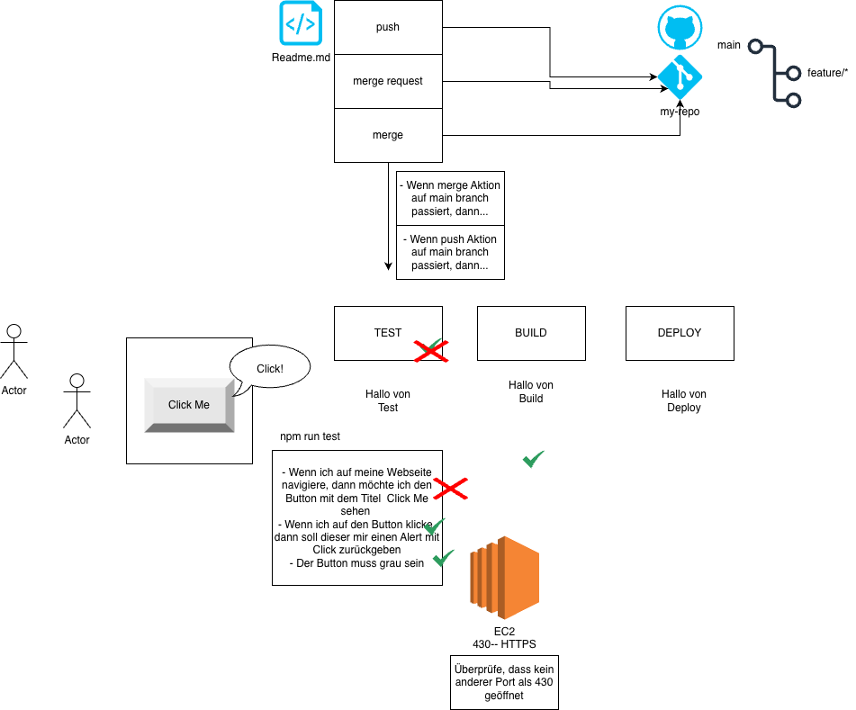
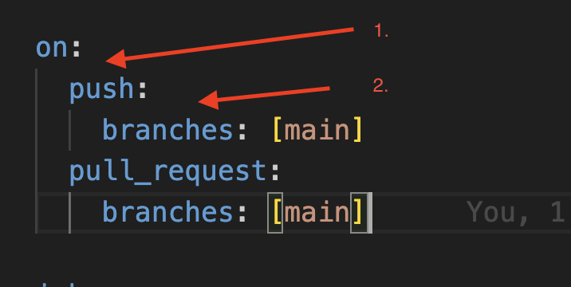
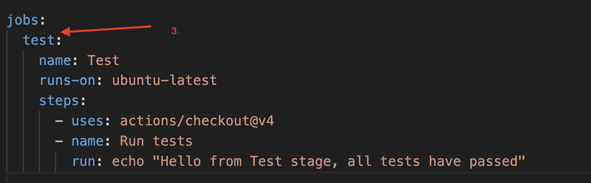

# Git in Verbindung mit CI/CD

## Git

- In Visual Studio Code Fenster am besten immer eine einzelne Projektmappem hineinziehen

### Voraussetzung:

- Auf Github.com Account sollte bereits ein ssh Key hinterlegt sein (Falls nicht klicke [HIER](https://docs.github.com/en/authentication/connecting-to-github-with-ssh/generating-a-new-ssh-key-and-adding-it-to-the-ssh-agent))

- Die globalen Variablen sind auf eurem System hinterlegt

```bash
    $ git config --global user.name "John Doe"
    $ git config --global user.email johndoe@example.com
```

### Lokal ein Git Repository erstellen

1. `git init`: Lokal das Repository zu initialisiern/VCS in der Projektmappe hinterlegen
2. `git add .`: Fügt alle Dateien zu der gestageten area (alle Dateien die an einen Commit angehängt werden sollen)
3. `git commit -m "initial commit"`(Für genaue Commit message findest du mehr [HIER](https://www.conventionalcommits.org/en/v1.0.0/))
4. `.gitignore` anlegen um kontinuirlich Dateien zu verweisen die nicht getracked werden sollen von git

### Verknüpfung auf ein remote repository hinbekomme

1. Remote repository erstellen auf dem Github.com Account
2. Anweisungen auf neuem Repository folgen (...push existung repository)
3. Bei den Befehlen beachten, dass ihr SSH ausgewählt habt, dann sollte die origin url mit `git` anfangen

```bash
git remote add origin git@github.com:tomschiffmann-teaching/02_git_ci_cd.git
git branch -M main
git push -u origin main
```

4. `git pull` um **Commits vom aktuellen Branch** zu synchen

## Branching

- Standardmäßig ist der `main` Branch immer der Ausgangspunkt
- Was sind Branches überhaupt: Unterschiedliche Zustände einer Software (z.B. ein weiteres Feature, welches sich noch in der Entwicklung befindet)

1. Auf den main Branch wechseln `git checkout main`
2. `git pull`: Um die aktuellsten Änderungen von dem main Branch zu synchen (denkt dran es können Commits nicht nur auf eurem PC passieren)
3. `git checkout -b feature/<branch-name>`
4. Entwicklung (commits passieren nur auf diesem Branch)
5. `git push` pusht die commits auf **diesen Branch**
6. Wenn die Entwicklung abgeschlossen ist, dann wird ein Merge Request/ Pull Request erstellt über z.B. Github.com
7. Dieser PR wird dann mit anderen Entwicklern geteilt und zum Review freigegeben
8. Wenn die Änderungen approved(bestätigt) wurden, dann kann dieser in den main Branch gemerged werde
9. Nachdem ein Feature Branch fertig entwickelt wurde und gemerged wurde, dann sollte der Feature Branch gelöscht werden [Siehe Cheat Sheet](https://git-scm.com/cheat-sheet)
   --> Branch muss remote und lokal gelöscht werden

#### Hint

- Ein Feature sollte nie auf main gebracht werden, ohne vorher durch ein Review gelaufen zu sein

## Merge Konflikte beheben

- Häufig entwickelt man in der selben Datei und läuft dann in sog. Merge Konflikte
- Ausgang: Feature-Branch kann nicht auf main gemerged werden, da Merge Konflikt blockiert

### Einfache Option, um Merge Konflikte zu beheben

1. Lokal (in VSCode)
2. `git checkout main` und dann die letzten Änderungen mit `git pull` ziehen
3. Zurück auf feature Branch mit `git checkout <feature-branch>`
4. `git merge main`
5. Merge Konflikte beheben (`Incoming`oder `Current` Change Accepten)
6. Merge Resolve pushen
7. Überprüfen, ob germerged werden kann
8. Mergen :)

## Zusammenfassende Skizze



# Einführung in Github Actions



## Warum nutzt man das überhaupt?

- Automatisierung (z.B. Ausführung Tests automatisieren)
- Compliance & Governance
- Integrität der App (Qualitätssicherung)
- Konsitenz
- Unabhängigkeit
- Skalierbarkeit der Software

## 1. Was für Möglichkeiten haben wir, um so eine Pipeline/Workflow/Github Actions auszulösen (on)

- `workflow_dispatch`
- `schedule`
- `push`
- `merge_request`



## 2. Branches auswählen, auf denen die jobs ausgeführt werden sollen

## 3. Jobs



```bash
jobs:
  test: # <-- der job Test
    name: Test # <-- mit dem Namen
    runs-on: ubuntu-latest # <-- Das Image auf dem das Skript (in dem fall echo... laufen soll. Das muss natürlich den Befehl unterstützen)
    steps:
      - uses: actions/checkout@v4
      - name: Run tests # <-- mit dem Namen
        run: echo "Hello from Test stage, all tests have passed" # <-- run hinterlegt das Skript was letzendlich ausgeführt werden soll

```
